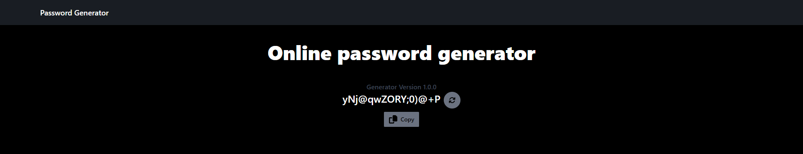

# Random Password Generator

## Description

This is a simple Next.js web application that generates random passwords and provides the ability to refresh for a new password or copy the generated password to the clipboard.



## Features

- Generate Random Passwords: The app allows users to generate random passwords with a combination of letters (both uppercase and lowercase), numbers, and special characters.

- Refresh Password: Users can refresh the generated password to get a new one without refreshing the entire page.

- Copy to Clipboard: Users can easily copy the generated password to the clipboard with a single click for easy use.

## Installation and Usage

1. Clone the repository:

```bash
git clone https://github.com/your-username/password-generator.git
cd password-generator
```

2. Install the dependencies:

```bash
npm install
```

**or**

```bash
yarn install
```

3. Run the development server:

```bash
npm run dev
```

**or**

```bash
yarn dev
```

4. Open your web browser and navigate to `http://localhost:3000` to use the app.

## Technologies Used

- Next.js: A React framework for building server-side rendered (SSR) and statically generated (SSG) web applications.
- React: A JavaScript library for building user interfaces.
- Tailwind CSS: A utility-first CSS framework used for styling the app.

## Contributing

Contributions are welcome! If you find any issues or have ideas for improvement, feel free to open a pull request.

## License

none
